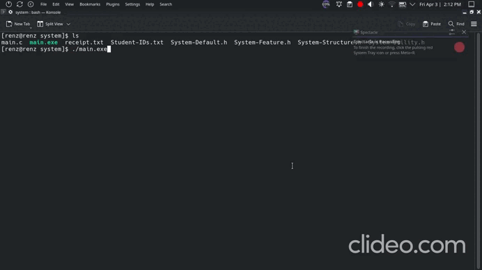

# CafeteriaManagementSystem-in-C

## Demo

## How to run
- clone this repo:

      git clone https://github.com/zionabyrke/CafeteriaManagementSystem-in-C.git
      cd CafeteriaManagementSystem-in-C

- run the program:

      gcc main.c -o main.exe
      ./main.exe
